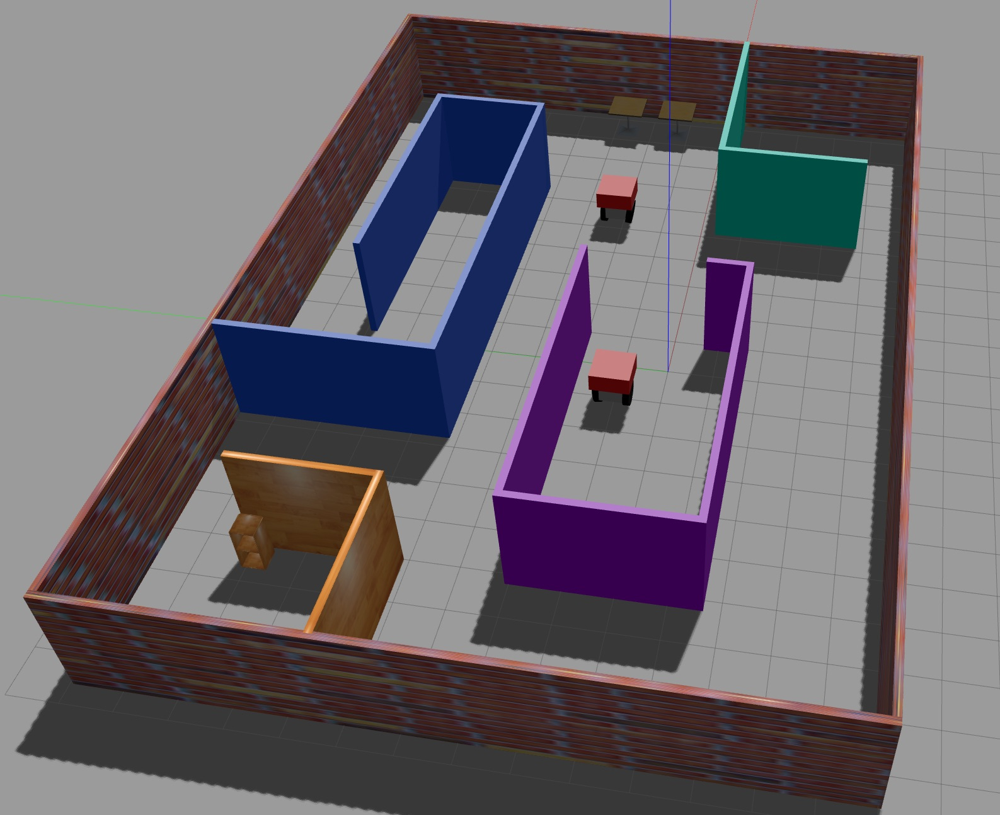

# Assignment 1: Build My World

To build:
```sh
$ mkdir build && cd build
$ cmake ../
$ make
```

To run:   
```sh
$ cd world
$ gazebo roboworld
```
furniture models taken from <https://bitbucket.org/osrf/gazebo_models>


