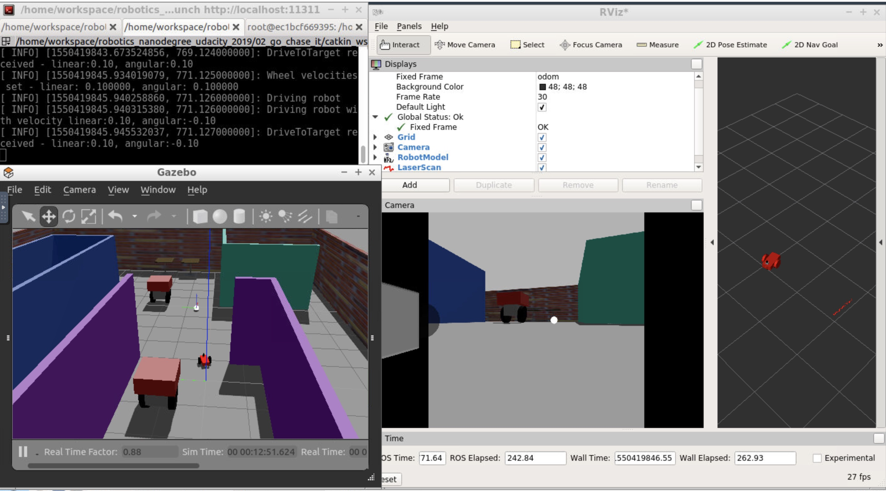

# Assignment 2: Go Chase it!

To build and launch robot world:
```
$ catkin_make
$ source devel/setup.bash
$ roslaunch my_robot world.launch
```

Run `drive_bot` and `process_image` nodes:
```
$ source devel/setup.bash
$ roslaunch ball_chaser ball_chaser.launch
```

Visualize robot's camera (or use RViz):
```
$ source devel/setup.bash
$ rosrun rqt_image_view rqt_image_view 
```

RViz Setup
- Select `odom` for fixed frame
- Add `RobotModel`
- Add by topic `Camera` with `/camera/rgb/image_raw`
- Add by topic `LaserScan` with `/scan`
### Testing
To publish velocity commands to the robot’s wheel actuators:
```
rostopic pub /cmd_vel geometry_msgs/Twist "[0.1, 1, 1]" "[0, 0, 0.1]"
```


