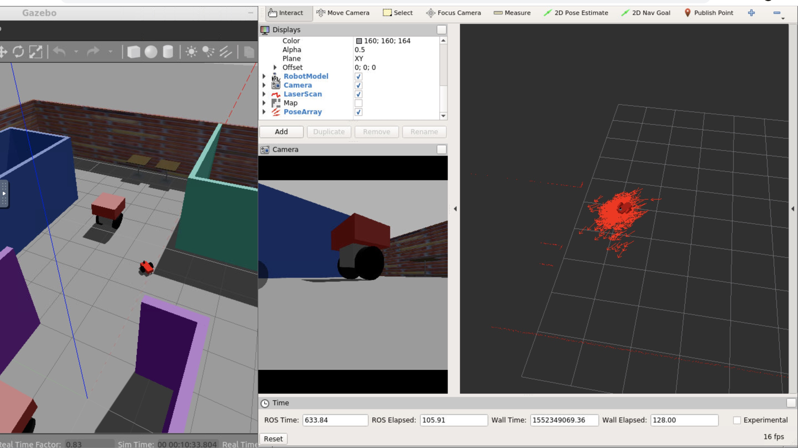
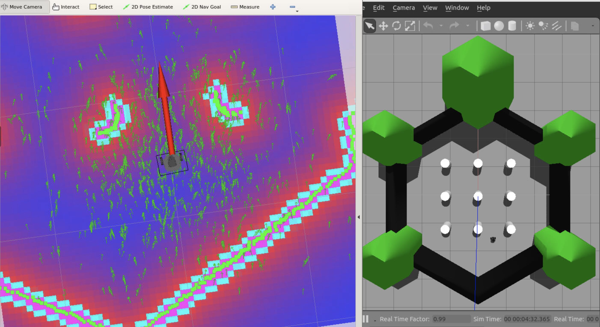

# Assignment 3: Where Am I

## To build and launch robo world with AMCL & rviz:
```sh
$ catkin_make
$ source devel/setup.bash
$ roslaunch robo world.launch
```

## Controlling robo:
(1) Set navigation goal in rviz:
- Click on `2D Nav Goal` on the topbar in rviz

(2) Add teleop package to navigate robo with keyboard:
```sh
$ cd src && git clone https://github.com/ros-teleop/teleop_twist_keyboard
$ cd .. && catkin_make
$ source devel/setup.bash
$ rosrun teleop_twist_keyboard teleop_twist_keyboard.py
```


## References 
PGM map creator:
```
$ apt-get install libignition-math2-dev protobuf-compiler
$ git clone https://github.com/udacity/pgm_map_creator
Follow readme instructions
```

AMCL:
- AMCL configs:
http://wiki.ros.org/navigation/Tutorials/RobotSetup
- AMCL parameters:
http://wiki.ros.org/amcl#Parameters

## Turtlebot3
http://emanual.robotis.com/docs/en/platform/turtlebot3/getting_started/#about-turtlebot3

To build turtlebot3:
```sh
$ mkdir src && cd src
$ git clone https://github.com/ROBOTIS-GIT/turtlebot3_simulations
$ git clone https://github.com/ROBOTIS-GIT/turtlebot3_msgs.git
$ git clone https://github.com/ROBOTIS-GIT/turtlebot3.git
$ cd .. && catkin_make
```

To run turtlebot3 simulation:
```sh
$ source devel/setup.bash
$ export TURTLEBOT3_MODEL=burger # [burger, waffle, waffle_pi]
$ roslaunch turtlebot3_gazebo turtlebot3_world.launch
```
To run turtlebot3 navigation:
```sh
$ roslaunch turtlebot3_navigation turtlebot3_navigation.launch
```


