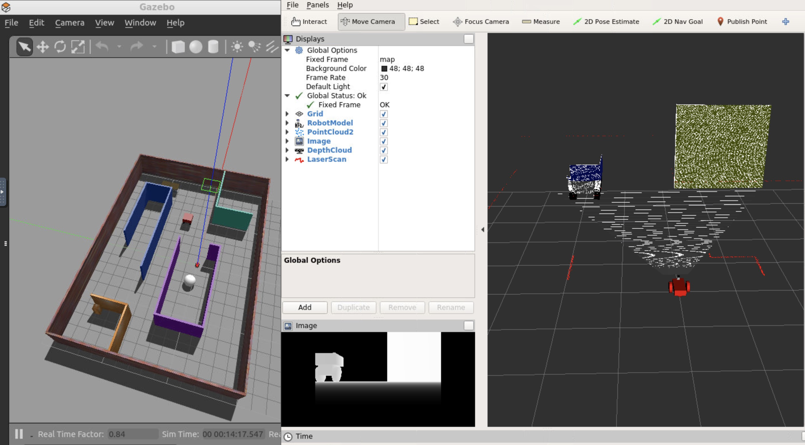
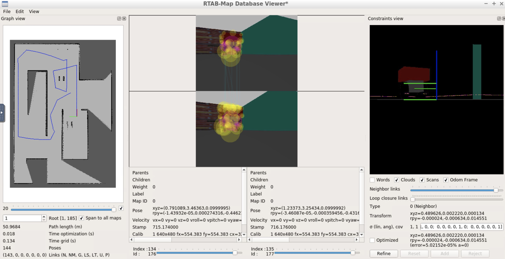

# Assignment 4: Map My World

## To build and launch robo world with RTAB-Map (Real-Time Appearance-Based Mapping)
```sh
$ catkin_make
$ source devel/setup.bash
$ roslaunch robo world.launch
```

## Controlling robo
Add teleop package to navigate robo with keyboard:
```sh
$ cd src && git clone https://github.com/ros-teleop/teleop_twist_keyboard
$ cd .. && catkin_make
$ source devel/setup.bash
$ rosrun teleop_twist_keyboard teleop_twist_keyboard.py
```

## Download and view rtabmap database
```sh
$ curl -L https://github.com/alyssaq/robotics_nanodegree_udacity_2019/raw/rtabmap/rtabmap.db rtabmap.db
$ rtabmap-databaseViewer rtabmap.db
```
#### Viewer Settings
View -> Constraint View   
View -> Graph View

## References 
* [RTAB-Map Node](http://wiki.ros.org/rtabmap_ros#Tutorials)
* [ROS Depth Camera Integration](http://gazebosim.org/tutorials?tut=ros_depth_camera&cat=connect_ros)

## Screenshots
Rviz with RGBD data


RTAB-Map Database Viewer

